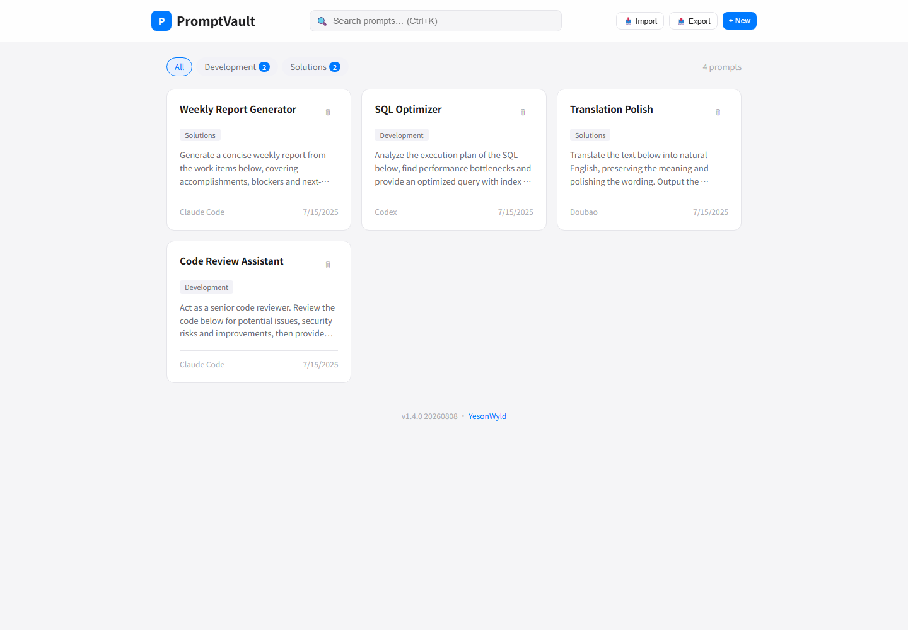

# PromptVault · AI Prompt Manager

[](LICENSE)

A **zero-dependency, single-file** AI prompt manager. Runs directly in your browser; all data is stored in localStorage. No server, no installation.

> 🌐 Language: [中文](README.md) | English

## ✨ Features

- **📝 Prompt management** — create, edit, delete and view AI prompts; supports name, body, notes, tools and tags
- **🏷️ Tag categories** — custom tag system; filter prompts by tag, with tag autocomplete
- **🔍 Full-text search** — searches name, body, tags and tool names, with a 200ms debounce
- **🛠️ Tool association** — mark which AI tool each prompt targets (Claude Code, Doubao, Codex, etc.); multiple tools supported
- **📱 Responsive design** — desktop and mobile, adaptive card grid
- **🌗 Dark mode** — automatically follows the system theme (`prefers-color-scheme`), Apple-style UI
- **📦 Import / Export** — JSON format; drag-and-drop a JSON file to import
- **✍️ Auto-naming** — extracts the name from the first line when you paste a prompt body
- **📊 Word count** — real-time character and line count for the body
- **🔒 Local data only** — everything stays in browser localStorage; no privacy leaks

## 📸 Screenshot



## 🚀 Quick Start

> 💻 **Live demo** (GitHub Pages): <https://YesonWyld.github.io/prompt-vault/>
>
> 📦 **Source repository**: <https://github.com/YesonWyld/prompt-vault>

1. Download `prompt-vault.en.html` (English) or `prompt-vault.html` (中文)
2. Open it in a browser — done
3. (Optional) deploy it to any static file server

```bash
# Local preview
open prompt-vault.en.html

# Or serve it with Python
python -m http.server 8080
```

## 📖 Usage Guide

### Create a prompt

Click the **+ New** button in the top-right corner and fill in:

| Field | Description |
|------|------|
| Name | Auto-generated after pasting the body; can be edited manually |
| Tools | Click an existing tool to select it, or type a new tool name |
| Tags | Type a tag name and press Enter to add it; batch input supported |
| Prompt body | Required; multi-line text supported |
| Notes | Optional; record usage tips or results |

### Filter & search

- **Tag filter**: click a tag chip at the top to filter
- **Full-text search**: searches name, body, tags and tool names
- **Shortcut**: `Ctrl+K` focuses the search box

### Import & export

- **Export**: click **Export** to download a JSON file
- **Import**: click **Import** to pick a file, or drag a JSON file onto the page

Exported JSON is compatible across versions; duplicate entries are skipped automatically.

## 🛠️ Tech Stack

- Plain HTML/CSS/JavaScript — zero frameworks, zero build tools
- CSS Custom Properties for theming
- localStorage for persistence
- Event delegation + debounce for performance

## 📁 Project Structure

```
prompt-vault/
├── prompt-vault.html            # Main app — Chinese version (~1300 lines)
├── prompt-vault.en.html         # Main app — English version
├── assets/
│   ├── favicon.ico              # Site icon
│   ├── favicon.png
│   ├── screenshot.png           # Chinese version preview
│   └── screenshot-en.png        # English version preview
├── .github/workflows/pages.yml  # GitHub Pages auto-deploy
├── README.md                    # Chinese docs
├── README.en.md                 # English docs
├── CHANGELOG.md
├── LICENSE
└── .gitignore
```

## ⚠️ Notes

- Data is stored in browser localStorage; clearing browser data will lose it — export backups regularly
- localStorage has a 5–10MB capacity limit; when exceeded, the app prompts you to export and clean up
- Copy works on both `file://` and HTTPS

## 📄 License

[MIT](LICENSE) © 2026 YesonWyld
