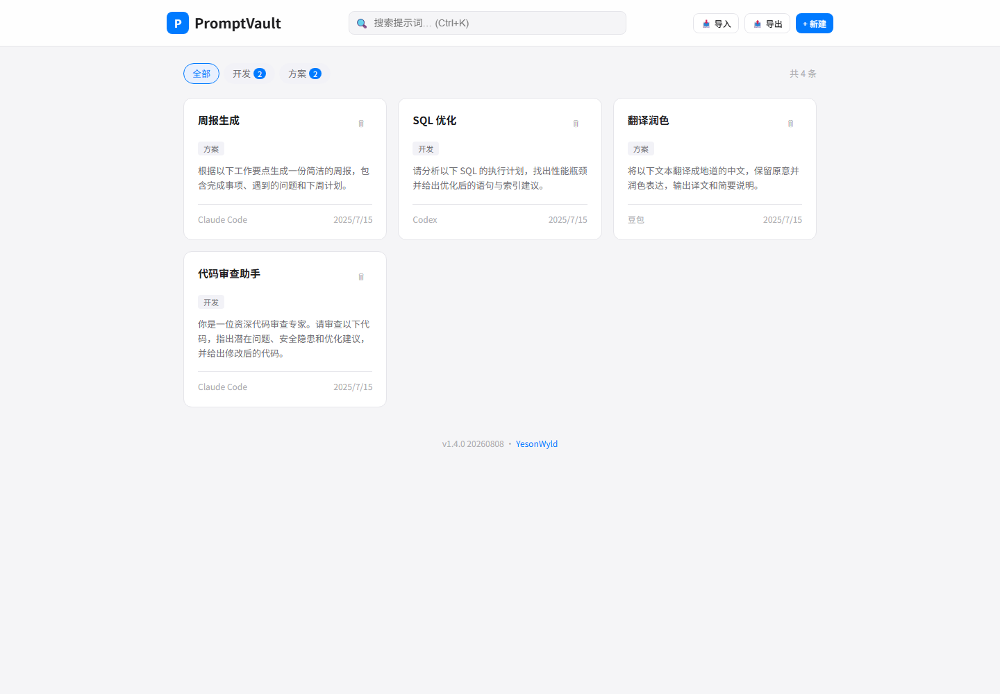

# PromptVault · 提示词宝库

[](LICENSE)

一个**零依赖、单文件**的 AI 提示词管理工具。在浏览器中直接运行，所有数据存储在 localStorage 中，无需服务器、无需安装。

> 🌐 语言：中文 | [English](README.en.md)

## ✨ 功能特性

- **📝 提示词管理** — 新建、编辑、删除、查看 AI 提示词，支持名称、正文、备注、工具、标签
- **🏷️ 标签分类** — 自定义标签系统，按标签筛选提示词，支持标签自动补全
- **🔍 全文搜索** — 搜索名称、正文、标签、工具名，带 200ms 防抖优化
- **🛠️ 工具关联** — 为每条提示词标记适用的 AI 工具（Claude Code、豆包、Codex 等），支持多工具选择
- **📱 响应式设计** — 适配桌面端和移动端，卡片网格自适应布局
- **🌗 深色模式** — 自动跟随系统主题（`prefers-color-scheme`），Apple 风格 UI
- **📦 导入/导出** — JSON 格式导入导出，支持拖拽 JSON 文件到页面上导入
- **✍️ 自动命名** — 粘贴提示词正文时自动从首行提取名称
- **📊 字数统计** — 正文区域实时显示字数和行数
- **🔒 数据本地化** — 全部数据存储在浏览器 localStorage 中，无隐私泄露风险

## 📸 界面预览



## 🚀 快速开始

> 💻 **在线体验**（GitHub Pages）：<https://YesonWyld.github.io/prompt-vault/>
>
> 📦 **源码仓库**：<https://github.com/YesonWyld/prompt-vault>

1. 下载 `prompt-vault.html`（中文版）或 `prompt-vault.en.html`（英文版）
2. 用浏览器打开即可使用
3. （可选）部署到任意静态文件服务器

```bash
# 本地预览
open prompt-vault.html

# 或用 Python 起一个本地服务器
python -m http.server 8080
```

## 📖 使用指南

### 新建提示词

点击右上角「+ 新建」按钮，填写：

| 字段 | 说明 |
|------|------|
| 名称 | 粘贴正文后自动生成，可手动修改 |
| 适用工具 | 点击已有工具快速选择，或输入新工具名 |
| 标签 | 输入标签名按 Enter 添加，支持批量输入 |
| 提示词正文 | 必填，支持多行文本 |
| 备注 | 选填，记录使用技巧或效果评价 |

### 筛选与搜索

- **标签筛选**：点击顶部标签 chip 按标签过滤
- **全文搜索**：搜索框支持搜索名称、正文、标签、工具名
- **快捷键**：`Ctrl+K` 聚焦搜索框

### 导入导出

- **导出**：点击「导出」按钮下载 JSON 文件
- **导入**：点击「导入」按钮选择文件，或将 JSON 文件拖入页面

导出的 JSON 文件兼容跨版本导入，重复条目会自动跳过。

## 🛠️ 技术栈

- 纯 HTML/CSS/JavaScript，零框架、零构建工具
- CSS 自定义属性（Custom Properties）实现主题切换
- localStorage 持久化存储
- 事件委托 + 防抖优化性能

## 📁 项目结构

```
prompt-vault/
├── index.html                  # 首页入口（语言选择）
├── prompt-vault.html           # 主应用文件 · 中文版（~1300 行）
├── prompt-vault.en.html        # 主应用文件 · 英文版
├── assets/
│   ├── favicon.ico             # 站点图标
│   ├── favicon.png
│   ├── screenshot.png          # 中文版预览截图
│   └── screenshot-en.png       # 英文版预览截图
├── .github/workflows/pages.yml # GitHub Pages 自动部署
├── README.md
├── README.en.md                # 英文说明文档
├── CHANGELOG.md
├── LICENSE
└── .gitignore
```

## ⚠️ 注意事项

- 数据存储在浏览器 localStorage 中，清除浏览器数据会导致数据丢失，请定期导出备份
- localStorage 有 5-10MB 的容量上限，超出时会提示用户导出清理
- 复制功能在 `file://` 协议和 HTTPS 环境下均可正常使用

## 📄 许可证

[MIT](LICENSE) © 2026 YesonWyld
